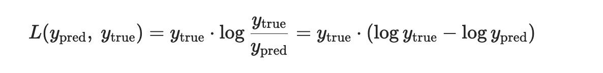
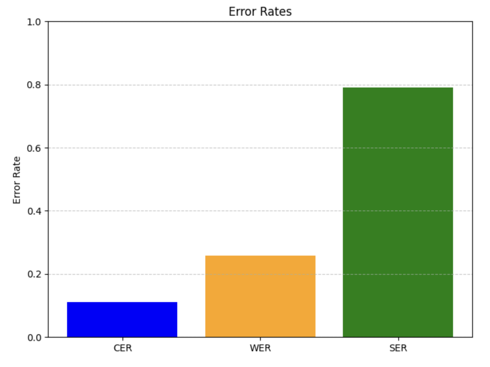
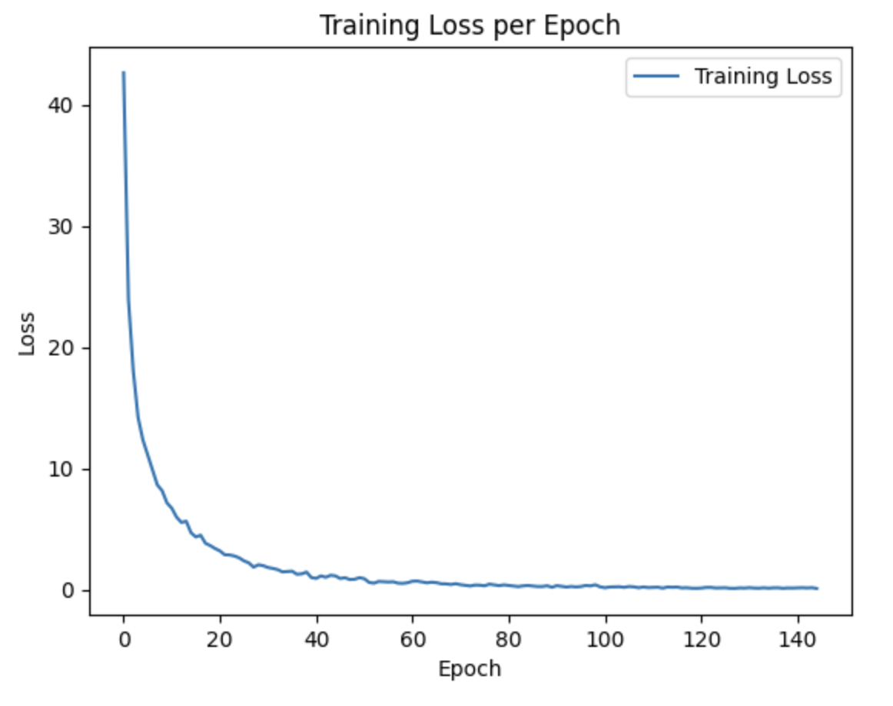
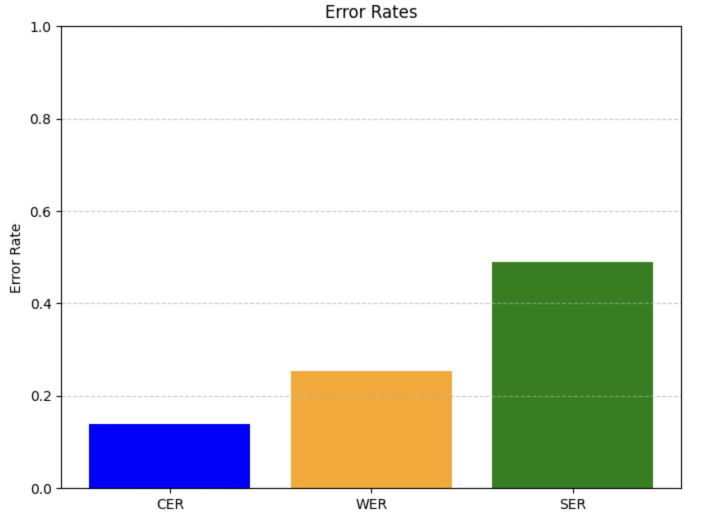
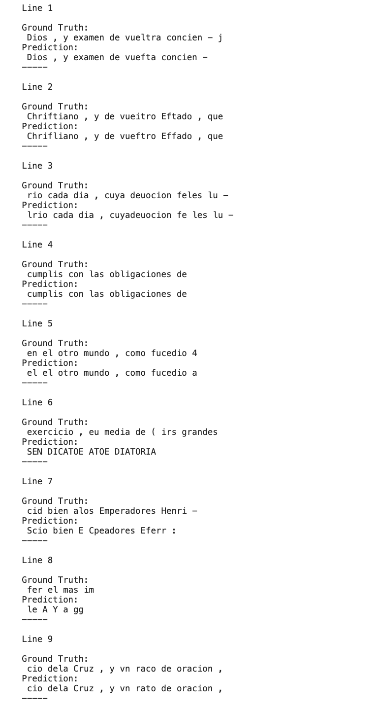

# HumanAI Submission 2024

## Text Recognition with Transformer Models

This project was focussed on the application of hybrid end-to-end models based on transformers to recognize text in Spanish printed sources from the seventeenth century.

### Architecture

This model combines ResNet-101 for feature extraction with a Transformer architecture for sequence modeling. Initially, ResNet-101 extracts visual features, which are then passed through a 1x1 convolutional layer to adapt their dimensionality. The Transformer processes these features along with positional encodings, capturing spatial and sequential information. It predicts token probabilities through linear layers, facilitating Optical Character Recognition tasks.

### Loss Function

KLDivLoss : 

### General Dataset Used:
Bentham Dataset -> [Download Link](https://zenodo.org/records/44519)

To preprocess the data, run the main() function in `data_preprocess/bentham_transform.py` or download the preprocessed dataset here: [Bentham Preprocessed Data](https://amritauniv-my.sharepoint.com/:u:/g/personal/amenu4aie21178_am_students_amrita_edu/ERzvGI5PulVMoICHoHoYKnkBo0We64Nb-CuktTtfvbLQ3Q?e=8M2Y32)

Epochs : 200

Pretrained weights can be downloaded here -> [Pretrain Weights](https://amritauniv-my.sharepoint.com/:u:/g/personal/amenu4aie21178_am_students_amrita_edu/EV1DDTWIW2RHqefzHkXvU-ABm478tzOOtCtSh1ts9TDy7w?e=VjhtcO)

Test Result: 

Evaluation Metrics Used:

CER - Character Error Rate

WER - Word Error Rate

SER - Sequence Error Rate
 

### Specific Dataset: 

The pre-trained the Transformer model using the Bentham dataset, was fine-tuned on the specific dataset (Spanish Literature). Utilized Pytesseract to segment entire pages into individual lines, which were then preprocessed prior to training the model.

Epochs: 150

Fine Tuned weights can be downloaded here -> [Fine Tune Weights](https://amritauniv-my.sharepoint.com/:u:/g/personal/amenu4aie21178_am_students_amrita_edu/Ee6oR0L2H7lMhpoCcm_Sdd0B1XJlt5x2pMghVVIyrl5Z4g?e=GmgjeY)

Loss vs Graph:

Test Results over all images:

Evaluation Metrics Used:

CER - Character Error Rate

WER - Word Error Rate

SER - Sequence Error Rate

Test Page 30: Visual Result: (The Ground Truth has been calculated using pytesseract OCR)

